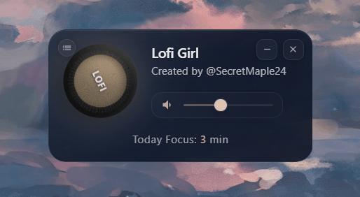
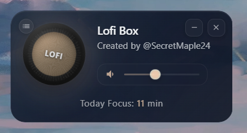
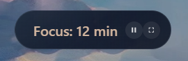
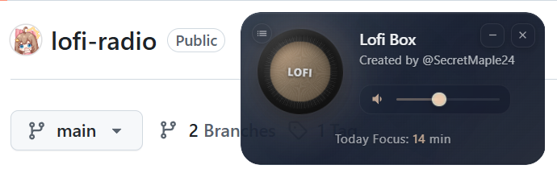
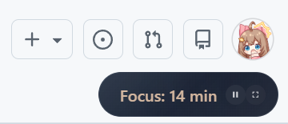

# Lofi Radio Player

**[点击这里下载（绿色版免安装）](https://github.com/labilio/lofi-radio/releases/tag/Lofi-Radio)**

> 💡 **macOS 用户提示**：首次打开可能需要右键点击应用 → 选择"打开"，或在系统设置中允许运行




---

**几乎所有手机都有灵动岛功能，也有大量的专注计时器软件，电脑为什么没有呢？**

## 简介

这是一个精简小巧的桌面音乐播放器，挂在屏幕上。
**就像把咖啡店的背景音乐搬进你的书房**

不需要本地音源，不需要选歌单。下载后直接打开即可收听。

- 两种模式：黑胶唱片 / 灵动岛风格
- 16 种电台：不仅是 Lofi，学习工作时的沉浸陪伴
- 全局快捷键：一键暂停，不打断专注
- 专注计时：记录你的每一次深度工作

---

## 界面展示

| 普通模式 | Mini 模式 (灵动岛风格) |
| :---: | :---: |
|  |  |
|  |  |
| *黑胶唱片质感* | *小巧玲珑，不占空间* |

---

## 功能特点

- **沉浸体验**：7x24 小时无限播放 Lofi 音乐（有助于专注工作学习的安静音乐）。

- **双形态切换**：
  - 普通模式：旋转发光黑胶唱片质感
  - Mini 模式：仿灵动岛设计，小巧玲珑

- **桌面陪伴**：可以挂在屏幕上的任何地方，安静陪伴不打扰

- **多电台支持**：内置 16 个精选电台，点击左上角按钮即可切换，覆盖多种音乐风格
  - 🎧 **Lo-Fi / Chill**：Lofi Girl、Lofi Box、Chill Sky、Chill Wave、Groove Salad、ASP、Paradise、Drone Zone
  - 🎷 **Jazz**：Jazz Box，Jazz Groove、Jazz Smooth
  - 🎻 **Classical**：Swiss Classic，BBC 3
  - 🎤 **Hip-Hop / Indie**：Rap、KEXP
  - 🌧️ **Ambient / Nature**：Rain Sounds

- **全局快捷键**：ALT+Q (Windows) / Option+Q (macOS) 一键暂停，不打断专注

- **专注计时**：记录今日专注时长，每日自动重置

- **记住偏好**：自动记住上次选择的电台，下次启动自动播放

---

## 电台列表

| 电台 | 风格标签 | 适用场景 | 特点 |
|------|---------|---------|------|
| **Lofi Girl** | Lo-fi / Chill | 学习 / 工作 | 最稳定，Bilibili 直播源 |
| **Lofi Box** | Lo-fi / Chill | 学习 / 工作 | 高性能 |
| **Chill Sky** | Chill / Electro | 阅读 | 放松氛围 |
| **Chill Wave** | Chill / Electro | 放松 | 电子氛围 |
| **Groove Salad** | Chill / Ambient | 编码 | 专注必备 |
| **ASP** | Ambient / Sleep | 助眠 | 深度放松 |
| **Paradise** | Chill / Alt | 休闲 | 多元风格 |
| **Drone Zone** | Ambient / Deep | 催眠 | 持续低音 |
| **Rain Sounds** | Ambient / Nature | 助眠 | 自然白噪音 |
| **Jazz Box** | Jazz / Smooth | 阅读 | 柔和爵士 |
| **Jazz Groove** | Jazz / Groove | 写作 | 律动爵士 |
| **Jazz Smooth** | Jazz / Mellow | 办公 | 轻柔爵士 |
| **Swiss Classic** | Classical / Symphony | 专注 | 交响乐 |
| **BBC 3** | Classical / Arts | 探索 | 艺术古典 |
| **Rap** | Hip-Hop / Beats | 运动 | 节奏驱动 |
| **KEXP** | Indie / Alt | 娱乐 | 独立音乐 |

---

## 你为什么要用这个？

### 不是在「听歌」，而是在「营造环境」

打开它，就像走进一家安静的咖啡店  
> 只有音乐，没有歌词，没有弹幕，没有干扰  
> 你是来把事情做完的，不是来消费内容的

### 16 种电台，而不是一个歌单

7x24 小时自动播放，歌曲不重复  
> QQ 音乐 / 网易云是歌单逻辑，听完就腻  
> 16 种风格，总有一款适合你当下的状态

### 随时可控，一键暂停

ALT+Q (Windows) / Option+Q (macOS)  
> 不需要切出窗口，专注不中断

### 即开即用，不设门槛

不翻墙，不用 Youtube / Spotify  
> 任意一台联网电脑，打开就能用

### 精简小巧，才是真正的沉浸

没有歌词滚动，没有MV，没有社交功能  
> 一个小部件挂在屏幕上，安静陪伴  
> 像咖啡店的背景音乐那样自然存在

### 弥补市场空缺：学习 APP 和音乐 APP 为什么不能放在一起？

既然来听专注音乐，本质目的是专注  
> 那为什么不顺手做一个  
> 类似 Forest / 番茄 To Do 的学习计时器？

### 弥补市场空缺：电脑上为什么不能有灵动岛？

灵动岛是一个很好的交互设计，但它只存在于手机上  
> 如果把播放器 + 计时器，塞进一个电脑端的小胶囊  
> 这件事本身就很有想象力

---

## 关于我

**Secret** - AI Product Manager Intern / Web3 实习计划学员 (ETH Panda/LXDAO)

> 正在寻找有趣的项目和合作机会

**我能提供：** 产品思维 / 独立开发 / 数据洞察 / Web3 & AI 基础知识分享

**开放：** 项目合作 / 行业交流 / 开源贡献

### 过往经历

- 前大厂**财务计划分析**实习生 / 国内头部会计师事务所**审计助理**
- B站**220 万播放量** 频道，作品获行业从业者普遍认可
- 独立设计美术虚拟产品并上架微信，**我做的虚拟产品被使用超 22 万次**
- 完全从 0 到 1 创建电商品牌，全流程单干，3 个月 GMV 破万，单日最高 1500+ 订单

### 联系我

- 推特：[@SecretMaple24](https://twitter.com/SecretMaple24)
- Telegram：https://t.me/SecretZ24

---

## 开源贡献

### 多电台切换功能 - [@WEP-56](https://github.com/WEP-56)

设计了多电台切换功能，包括：
- 电台列表界面（点击左上角按钮展开）
- 16 个精选电台的配置与流媒体播放支持
- HTML5 Audio + HLS.js 播放器架构
- 电台偏好记忆功能

### macOS 支持 - [@0xBrick-Li](https://github.com/0xBrick-Li)

Web3 实习计划学员 (ETH Panda/LXDAO)

---

## 技术栈

- Electron - 跨平台桌面应用框架
- HTML5 Audio + HLS.js - 流媒体播放
- CSS3 - 毛玻璃效果与动画

---

## 本地运行

```bash
git clone https://github.com/labilio/lofi-radio.git
cd lofi-radio
npm install
npm start
```

---

欢迎提交 Issue 和 Pull Request！

---

右上角点个 **Star（收藏）** 支持一下，感谢！
